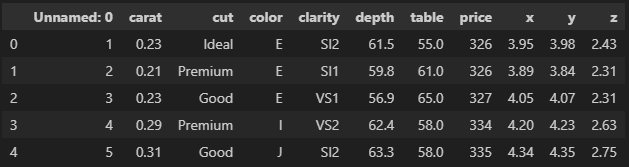
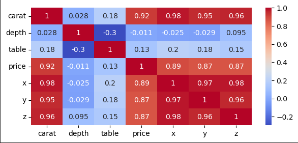

# Project4_Group4

## Diamond Price Prediction using Machine Learning

## Background
In this project we will be working on a dataset containing prices of different types of diamonds and create a machine learning model that will predict the price of diamonds. We will also compare these results using Linear Regression, and Random Forest Regression metrics.

## Project Members:
  * Pentyala, Soujanya
  * Atherton, Max
  * Kimm, June
  * Sarkar, Indrani

## Diamond:

Diamonds are the most prized precious stone on earth. They are also the hardest natural stone.  Diamonds are made from carbon under the extreme temperatures and pressure deep inside the earth. Volcanic activity brings them closer to surface where they are mined.  

## Dataset:

The dataset, which we will be using for the diamond price prediction task with machine learning, contains, data for almost 54,000 diamonds. It contains almost all the important characteristics of diamonds such as price, cut, quality, carat, weight, color, clarity, length, width, depth etc.

## Diamond features:
  * carat (carat weight of the diamond)
  * cut (cut quality of the cut)
  * color (color diamond color)
  * clarity (clarity a measurement of how clear the diamond is)
  * x (length in mm)
  * y (width in mm)
  * z (depth in mm)
  * depth (total depth percentage = z / mean(x, y))
  * table (width of top of diamond relative to widest point)


## Application used:

  - Python - Libraries: Pandas, numpy, sklearn, matplotlib
  - Jupyter Notebook
  - Database - PGAdmin(PstgreSQL)

## Process:

### Data Exploration
First, we created the database using PGAdmin and then loaded data into the database. Next, we read the data through pandas dataframe.



### Data Cleaning
The minimum value of “x”, “y”, “z” is zero. This is incorrect, since diamonds are 3 dimensional objects. So, we need to filter out the bad data points. We also dropped unnecessary column.

```Python
df = df.drop(df[df["x"]==0].index)
df = df.drop(df[df["y"]==0].index)
df = df.drop(df[df["z"]==0].index)
df.drop(columns=['Unnamed: 0'], inplace=True)
```
A correlation heat map was created to determine correlation strengths between variables. The most obvious one being, with increase in size (carat) of a Diamond, we see an increase in the price as well.


 
 ### Convert Categorical variables to numerical values before building a ML model

 The dataset includes 3 categorical variables (cut, color, and clarity). We used label encoding technique to convert categorical columns into numerical ones.

 ### Train-test-split

After pre-processing the dataset, we need to split our data into training and testing set to avoid overfitting or underfitting problems. 

```Python
from sklearn.model_selection import train_test_split
X_train, X_test, y_train, y_test = train_test_split (X,y,train_size=0.8,random_state=42)
```
## Modeling
We have trained 2 Machine Learning models – Linear Regression and Random Forest Regressor.

### Linear Regression: 
Linear regression is used for finding a linear relationship between the target and one or more predictors.

Output: 

### Random Forest:
The Random Forest algorithm includes randomly sampling our data and randomly selecting variables/features from our dataset for each tree. Once the forest has been built, we take the average of all of the predictions to make the final output value. 

Output:

### Summary


