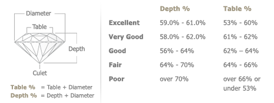

# Project4_Group4

## Machine Learning For Diamond Price Prediction

## Background
In this project we will be working on a dataset containing prices of different types of diamonds and create a machine learning model that will predict the price of diamonds. We will also compare these results using Linear Regression, Decision tree Regression and Random Forest Regression metrics.

### Project Members:
  * Pentyala, Soujanya
  * Atherton, Max
  * Kimm, June
  * Sarkar, Indrani

### Diamond:

Diamonds are the most prized precious stone on earth. They are also the hardest natural stone.  Diamonds are made from carbon under the extreme temperatures and pressure deep inside the earth. Volcanic activity brings them closer to surface where they are mined.  

### Dataset:

The dataset, which we will be using for the diamond price prediction task with machine learning, contains, data for almost 54,000 diamonds. It contains almost all the important characteristics of diamonds such as price, cut, quality, carat, weight, color, clarity, length, width, depth etc.

### Diamond features:
  * carat (carat weight of the diamond)
  * cut (cut quality of the cut)
  * color (color diamond color)
  * clarity (clarity a measurement of how clear the diamond is)
  * x (length in mm)
  * y (width in mm)
  * z (depth in mm)
  * depth (total depth percentage = z / mean(x, y))
  * table (width of top of diamond relative to widest point)

